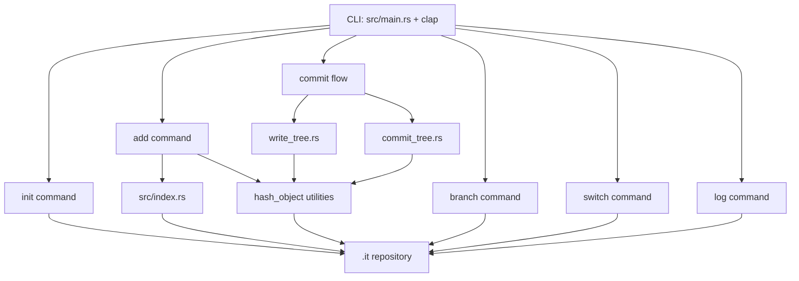

# it - Mini Git-like CLI in Rust

A small Rust project that implements a lightweight, Git-style version control CLI using a local `.it/` directory.

This project currently supports repository initialization, staging files, branching, switching branches, committing, and viewing logs.

## Project Structure

- `.it/objects` - object storage
- `.it/refs/heads` - branch pointers
- `.it/HEAD` - current branch reference
- `.it/index` - staging area
- `.it/logs` - commit and branch logs

## Current Architecture



## Run the CLI

Use Cargo to run commands:

```bash
cargo run -- <command> [args]
```

Example:

```bash
cargo run -- init
```

## Commands

### 1) `init`
Creates a new `.it` repository in the current directory.

```bash
cargo run -- init
```

What it does:
- Creates `.it/objects`
- Creates `.it/refs/heads/main`
- Sets `.it/HEAD` to `main`
- Initializes `.it/index` and log folders

---

### 2) `add <paths...>`
Stages one or more files/folders into the index.

```bash
cargo run -- add src/main.rs
cargo run -- add src notes.txt
```

What it does:
- Recursively walks input paths
- Skips `.it` and `target`
- Hashes file contents
- Updates entries in `.it/index`

---

### 3) `branch [name]`
Lists branches or creates a new branch.

List branches:

```bash
cargo run -- branch
```

Create a branch:

```bash
cargo run -- branch feature-x
```

What it does:
- Without name: prints all branches and marks current branch with `*`
- With name: creates branch ref from current HEAD commit

---

### 4) `switch <name>`
Switches `HEAD` to an existing branch.

```bash
cargo run -- switch feature-x
```

What it does:
- Validates branch exists in `.it/refs/heads`
- Updates `.it/HEAD` to point to that branch

---

### 5) `commit <message>`
Creates a commit from staged index content.

```bash
cargo run -- commit "Initial commit"
```

What it does:
- Builds a tree hash from index entries
- Reads parent commit from current branch
- Creates and stores a commit object
- Updates current branch ref to new commit hash
- Appends commit info to branch log

---

### 6) `log`
Prints log lines for the current branch.

```bash
cargo run -- log
```

What it does:
- Reads current branch from `.it/HEAD`
- Prints entries from corresponding `.it/logs/refs/heads/<branch>` file

---

### 7) `write`
Declared in CLI, currently placeholder (no operation).

```bash
cargo run -- write
```

---

## Typical Workflow

```bash
cargo run -- init
cargo run -- add src notes.txt
cargo run -- commit "first commit"
cargo run -- branch feature-x
cargo run -- switch feature-x
cargo run -- add src/commands
cargo run -- commit "work on feature"
cargo run -- log
```

## Notes

- Author/committer info for commit objects uses:
  - `GIT_AUTHOR_NAME`
  - `GIT_AUTHOR_EMAIL`
- If these are not set, the code uses `Unknown` defaults.
